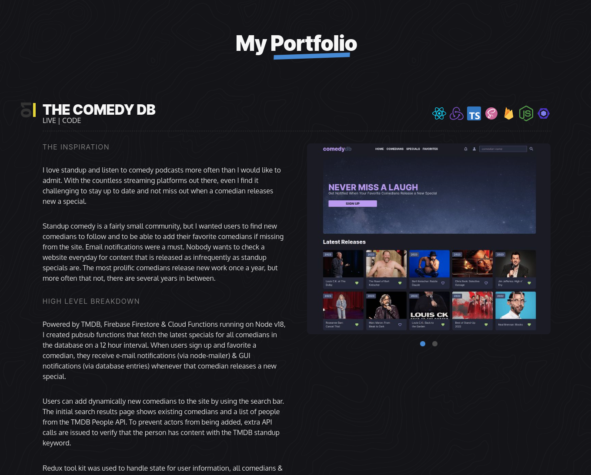
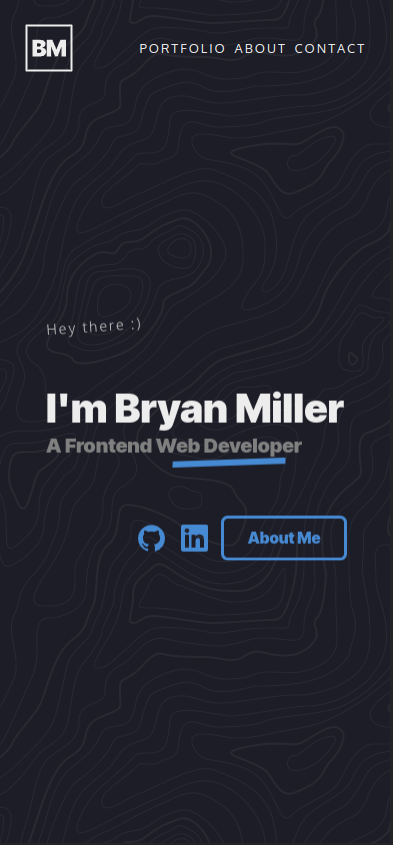
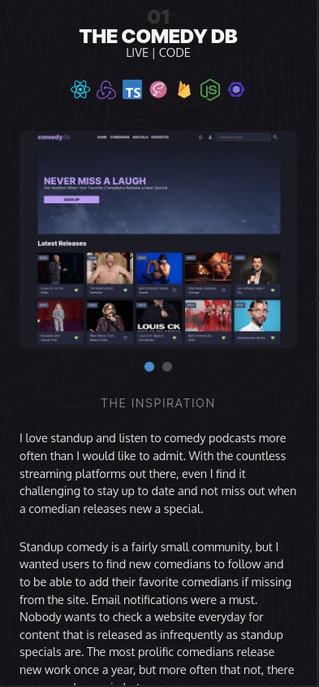
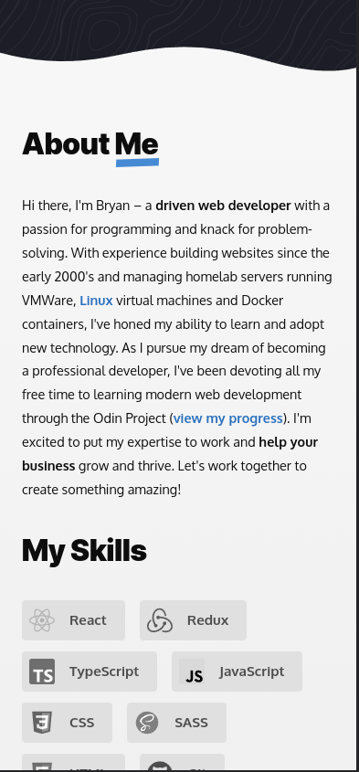
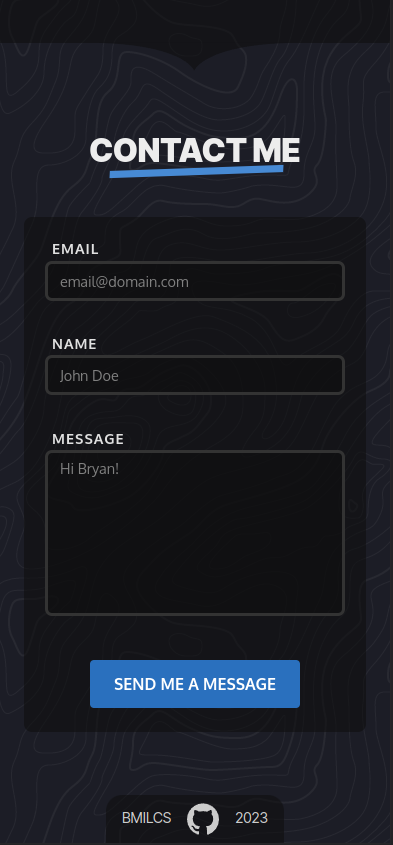

# Odin Project #24: Personal Portfolio

Welcome to Bryan Miller's Personal Portfolio Project, the [twenty fourth assignment](https://www.theodinproject.com/lessons/node-path-advanced-html-and-css-personal-portfolio) within the Odin Project curriculum. The goal of this repo is to practice the following skill sets:

- **Vite**: React, TypeScript + SWC
- Accessibility (a11y)
  - `aria-label`
  - `aria-labelledby`
  - `aria-hidden`
  - svg `role` and `<title>` attributes
- Advanced HTML & CSS
  - Semantic HTML
    - `section`
    - `header`
    - `footer`
    - `article`
  - Responsive Design
    - media-queries
    - grid & flex
  - Animation & Transitions
    - transform
    - opacity
    - keyframes

## Links

- [Live Demo](https://bmilcs.com)
- [My Odin Project Progress](https://github.com/bmilcs/odin-project)


## Summary

This project concludes the Advanced HTML & CSS section of the Odin Project curriculum. Fortunately, I had already learned the basics of CSS animations & transitions at the very beginning of my web development journey. Accessibility, on the other hand, is a new concept for me.

As someone who loves subtitles & keyboard-based interactivity, I have a natural appreciation for accessibility. With the help of Axe DevTools, the Chrome Accessibility Tree, and Lighthouse, I was able to score a `100%` for accessibility. I achieved this by using:

- Semantic HTML
- High contrast ratios
- Alt text on all images
- Focus indicators: colored borders & outlines on all interactive elements
- `aria-hidden` on decorative items, such as section dividers
- `aria-labels` for page regions, icon buttons/links (when missing context)
- `aria-labelledby` when a related element had the appropriate text content

## SOLID Design

Following SOLID design principles, I separated all project details away from the DOM in a separate file: `src/data/projects.ts`.

In `projects.ts`, the constant variable `PROJECTS` is assigned to an array of type-safe project objects:

```ts
export interface IProject {
  title: string;
  links?: {
    live: string;
    repo: string;
  };
  techIcons: TTech[];
  screenshots: TScreenshot[];
  description?: { type: 'header' | 'p'; value: string }[];
  bulletPoints?: string[];
}

export type TScreenshot = {
  url: string;
  alt: string;
};

type TTech =
  | 'react'
  | 'redux'
  | 'typescript'
  | 'javascript'
  | 'css'
  | 'sass'
  | 'firebase'
  | 'node'
  | 'html'
  | 'jest'
  | 'eslint'
  | 'babel'
  | 'webpack';

const PROJECTS: IProject[] = [];
```

The `Portfolio.tsx` React component imports the `PROJECTS` array and maps each project to a `Project.tsx` component. Having separated the data away from the DOM manipulation will make future style changes & project additions a breeze.

## CSS-Only Tooltips

It amazes me how far CSS has come and how it continues to grow over time. A simple data attribute (`data-tooltip`) allows all project dev icons to display a tooltip revealing their name.

This is implemented with a CSS `::after` pseudo-element, who's content is set with the `content: attr(data-tooltip)` property.

```css
/* src/app/App.scss */
[data-tooltip] {
  --tooltip-gap: 1rem;

  position: relative;
  cursor: pointer;

  color: var(--clr-primary-100);
  font-weight: bold;

  &::after {
    content: attr(data-tooltip);
    /* ... */
  }
```

```tsx
// src/components/dev_icon
type TProps = {
  tooltip: string;
  children: ReactNode;
};

function DevIcon({ tooltip: name, children }: TProps) {
  return (
    <div className='dev-icon' data-tooltip={name}>
      {children}
    </div>
  );
}
```

## Contact Form: Custom Validation & Async JS

For the contact form, I found a great free API solution called [Web3Forms](https://web3forms.com/). From there, I built out accessible & fully customized validation using React:

- Empty inputs show no error/validation messages
- Focused inputs show validation messages in gray until the requirements are met
- When requirements are met for a focused or unfocused field, the input border turns green
- Unfocused inputs that are invalid show a red border with a descriptive red error message

Elements were initially shifting around whenever a validation message appeared. To get around this, empty validation messages were set to "validated_input" and a class of "invisible" sets the opacity to 0.

The useState hook handles the sending & sent state, letting the user know when their e-mail has completed.

## Screenshots

> Hero


> Portfolio



> About


> Contact


> Accessibility Score


> Mobile Hero



> Mobile Portfolio



> Mobile About



> Mobile Contact



## Deployment

```sh
# clone repo & change directories
git clone https://github.com/bmilcs/portfolio bmilcs_portfolio/
cd bmilcs_portfolio

# install all dependencies
npm install

# run app
npm run dev
```
